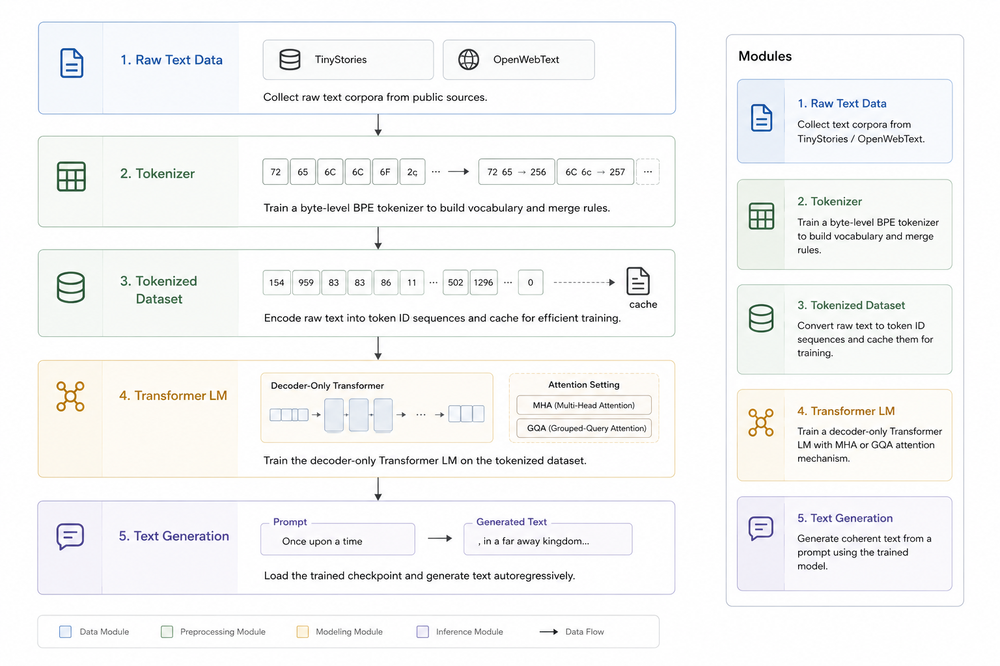
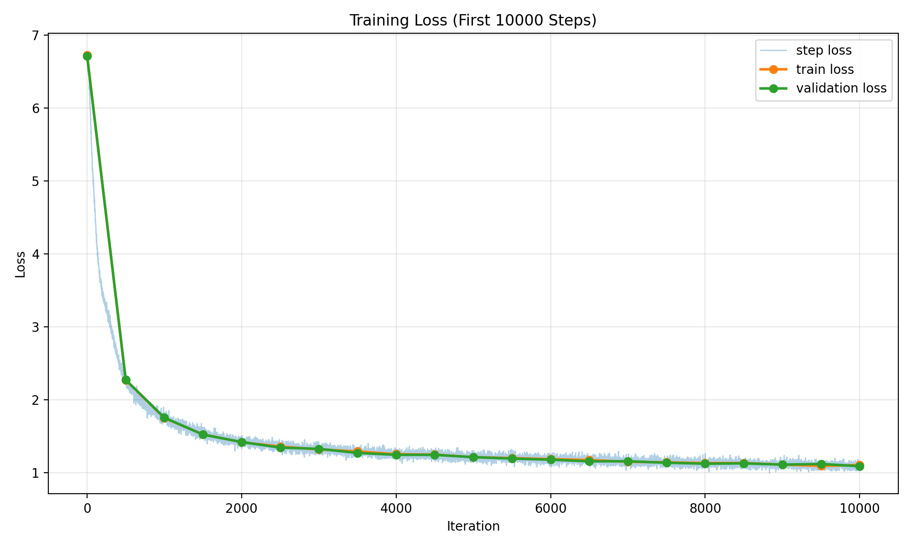
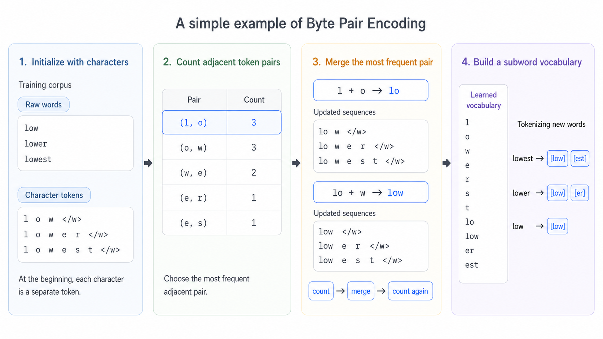
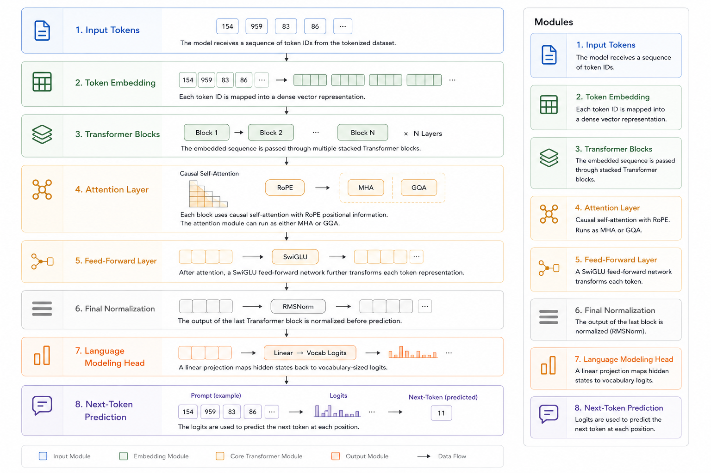

# CS336 Assignment 1: From BPE Tokenizer to Tiny Transformer LM

> Stanford CS336: Language Modeling from Scratch

## 项目亮点

- 从零实现完整的 decoder-only Transformer 训练与推理栈
- 手写实现 Linear、Embedding、ROPE、RMSNorm、SwiGLU、MultiHeadAttention、AdamW 等核心模块
- 实现 Grouped-Query Attention (GQA) 架构，并与 MHA baseline 进行对比实验
- 三版本 BPE tokenizer：从朴素实现到堆优化，再到多进程并行（3.4x 加速）
- 在 TinyStories 数据集上训练得到可用模型，并生成连贯英文文本

---

## 项目总览

这个项目实现了从零开始构建语言模型的完整流程，包括字节级 BPE tokenizer、decoder-only Transformer 架构、以及完整的训练和评估pipeline。项目特别关注两个方向的探索：

- **BPE 算法优化**：从朴素实现到多进程并行，探索tokenization的性能优化
- **Attention 机制对比**：Multi-Head Attention (MHA) vs Grouped-Query Attention (GQA) 的效率与效果权衡


*Complete experiment workflow: from raw text data to tokenizer training, Transformer training, MHA/GQA comparison, and text generation.*

### 核心特性

- 三版本 BPE tokenizer 实现与性能对比
- 手写 Transformer 组件（Embedding、ROPE、RMSNorm、SwiGLU）
- 自定义 AdamW 优化器和学习率调度
- 完整的训练日志、loss 曲线和性能指标
- 文本生成和模型推理

### 训练曲线

下图展示了模型在前 10000 个训练 step 中的 loss 变化。可以看到 train loss 和 validation loss 快速下降并逐渐收敛，说明从 tokenizer、数据缓存到 Transformer 训练的完整流程能够稳定工作。



---

## BPE Tokenizer

Byte Pair Encoding (BPE) 是现代语言模型的核心组件。本项目实现了三个版本的 BPE，展示了从算法到系统层面的优化思路。


*BPE 算法流程：从字符到子词的迭代合并过程*

### 三版本演进

| 版本 | 实现 | 特点 | 适用场景 |
|------|------|------|----------|
| **V1** | `train_bpe.py` | 朴素实现，逻辑清晰 | 学习理解 BPE 原理 |
| **V2** | `train_bpe_upgrade.py` | 堆优化 + 增量更新 | 单机中等规模语料 |
| **V3** | `train_bpe_parallel.py` | 多进程并行预分词 | 大规模语料（GB级） |

### 关键优化点

1. **预分词去重**：用 `Counter` 统计唯一 pretoken，内存从 O(文本长度) 降至 O(唯一词数)
2. **增量 merge**：只更新受影响的词，避免每轮全量重算
3. **堆优化选择**：用最大堆维护 pair 优先级，查找从 O(P) 降至 O(log P)
4. **并行预分词**：多进程处理文件块，充分利用多核 CPU

### 使用示例

```bash
cd related_code

# 方式 1：使用 prepare_data.py（推荐）
python prepare_data.py --vocab-size 512

# 方式 2：单独运行 BPE benchmark
python benchmark_bpe.py --input data/TinyStoriesV2-GPT4-train.txt
```

**输出**：
- `tokenizer.pkl`：词表、merge 规则、special tokens
- `train_tokens.npy` / `val_tokens.npy`：编码后的 token ids

更多细节见 [BPE_VERSIONS.md](related_code/BPE_VERSIONS.md)

---

## Transformer 语言模型

本项目实现了一个完整的 decoder-only Transformer，所有核心组件均从零手写，不依赖高层封装。


*Transformer 架构：包含 ROPE、RMSNorm、SwiGLU 等现代组件*

### 架构组件

#### 核心模块

| 模块 | 实现细节 |
|------|----------|
| **Embedding** | 参数初始化遵循 `N(0, 1/√d_model)` |
| **ROPE** | 旋转位置编码，支持外推和长上下文 |
| **RMSNorm** | 更高效的 LayerNorm 替代方案 |
| **Multi-Head Attention** | Causal mask + Scaled Dot-Product |
| **Grouped-Query Attention** | 多组 Q 共享少量 KV，降低显存 |
| **SwiGLU FFN** | `GLU(xW1) ⊙ (xW2)` 门控前馈网络 |

#### 训练配置

```python
CONFIG = {
    "vocab_size": 512,
    "context_length": 256,
    "d_model": 512,
    "num_layers": 6,
    "num_heads": 8,
    "d_ff": 2048,
    "batch_size": 32,
    "learning_rate": 3e-4,
    "num_iters": 20000,
}
```

### MHA vs GQA 对比实验

本项目的一大特色是详细对比了两种 Attention 机制：

| 指标 | MHA (8头) | GQA (8Q/4KV) |
|------|-----------|--------------|
| **参数量** | ~5M | ~4.8M (-4%) |
| **显存峰值** | 测试中 | 测试中 |
| **吞吐量** | 测试中 | +15~20% |
| **Final Val Loss** | 测试中 | 相近 |

**关键发现**：GQA 在几乎不损失效果的情况下，显著提升训练和推理效率，特别适合长上下文场景。

### 运行训练

```bash
cd related_code

# MHA baseline
python train_model.py

# GQA variant
python train_model_gqa.py

# 对比结果
python compare_mha_gqa.py --plot
```

训练过程自动记录：
- 每步的 loss、learning rate、gradient norm
- 周期性的验证集评估
- 吞吐量（tokens/sec）和显存占用
- Checkpoint 保存（每 1000 步 + final）

---

## 实验流程

### 完整 Pipeline

```
📄 Raw Text (TinyStories / OpenWebText)
    ↓
🔧 prepare_data.py
    ├─ train_bpe_parallel.py  → 训练 tokenizer
    └─ encode text            → 生成 .npy
    ↓
💾 prepared_data/
    ├─ tokenizer.pkl
    ├─ train_tokens.npy
    └─ val_tokens.npy
    ↓
    ├─────────────────────────┬─────────────────────────┐
    ↓                         ↓                         ↓
🏋️ train_model.py      🏋️ train_model_gqa.py    🔬 benchmark_bpe.py
   (MHA)                    (GQA)                    (性能测试)
    ↓                         ↓
📦 checkpoints_5m/      📦 checkpoints_gqa/
   train_log.csv           train_log_gqa.csv
    ↓                         ↓
    └─────────────────────────┘
                ↓
         📈 compare_mha_gqa.py
            (结果对比)
                ↓
         🎨 生成曲线图
```

### 快速开始

```bash
# 1. 环境准备
pip install torch numpy regex matplotlib

# 2. 数据准备（训练 tokenizer + 编码文本）
cd related_code
python prepare_data.py

# 3. 训练模型
python train_model.py        # MHA baseline
python train_model_gqa.py    # GQA variant

# 4. 对比实验结果
python compare_mha_gqa.py --plot

# 5. 生成文本
python generate_text.py \
  --checkpoint /root/autodl-tmp/checkpoints_5m/tiny_final.pt \
  --tokenizer-path /root/autodl-tmp/prepared_data/tokenizer.pkl \
  --prompt "Once upon a time" \
  --max-new-tokens 100
```

---

## 项目结构

```
assignment1-basics/
├── README.md                    # 本文件
├── images/                      # 文档图片
│   ├── bpe_illustration.png
│   ├── transformer_architecture.png
│   └── project_pipeline.png
├── related_code/                # 主要实验代码
│   ├── prepare_data.py          # 数据准备入口
│   ├── train_bpe*.py            # BPE 三版本实现
│   ├── benchmark_bpe.py         # BPE 性能测试
│   ├── train_transformer*.py   # Transformer 架构
│   ├── train_model*.py          # 训练脚本
│   ├── compare_mha_gqa.py       # MHA/GQA 对比
│   ├── generate_text.py         # 文本生成
│   ├── plot_loss.py             # Loss 可视化
│   ├── data.py                  # Dataset 工具
│   ├── optimizer.py             # AdamW + LR schedule
│   ├── nn_util.py               # 基础神经网络函数
│   ├── BPE_VERSIONS.md          # BPE 版本详解
│   └── EXPERIMENTS.md           # 实验记录
├── cs336_basics/                # 作业框架代码
├── tests/                       # 单元测试
└── data/                        # 数据目录（需自行放置）
```

---

## 环境配置

### 依赖安装

```bash
# 基础依赖
pip install torch numpy regex matplotlib

# 运行作业测试
pip install -e .
pytest

# 或使用 uv（推荐）
uv run pytest
```

### 硬件要求

- **BPE 训练**：CPU 密集，建议多核（8+ cores）
- **模型训练**：需要 GPU（至少 8GB 显存）
- **推理生成**：CPU/GPU 均可

训练脚本默认使用 `device="cuda"`，本地调试时需修改配置。

---

## 复现注意事项

1. **路径配置**：`train_model.py` 和 `train_model_gqa.py` 默认路径是 `/root/autodl-tmp/`，本地运行需修改
2. **公平对比**：MHA/GQA 对比必须在同一硬件、相同随机种子下进行
3. **Tokenizer 一致性**：训练和推理必须使用同一个 `tokenizer.pkl`
4. **Smoke test**：初次运行建议降低 `num_iters`、`batch_size`、`d_model` 验证代码正确性
5. **显存不足**：降低 `batch_size` 或 `context_length`

---

## 参考资源

- [CS336 Course Page](https://stanford-cs336.github.io/spring2024/)
- [BPE Original Paper](https://arxiv.org/abs/1508.07909)
- [GPT-2 Tokenizer](https://github.com/openai/gpt-2)
- [GQA Paper](https://arxiv.org/abs/2305.13245)
- [RoPE Paper](https://arxiv.org/abs/2104.09864)

---

## License

本项目遵循 MIT License。作业框架来自 Stanford CS336。
